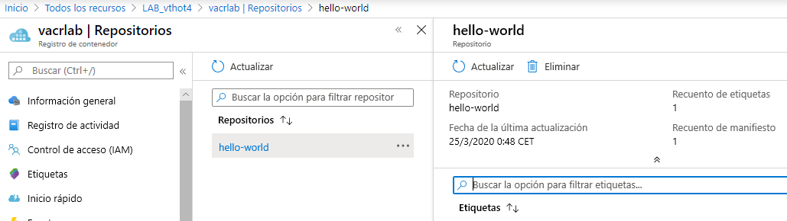

# Azure Container Registry (ACR).

Azure Container Registry es un servicio privado administrado del Registro de Docker que usa Docker Registry 2.0, que es de código abierto. Cree y mantenga los registros de Azure Container para almacenar y administrar las imágenes privadas del contenedor Docker y los artefactos relacionados. Los casos de uso que nos proponen en su documentación son:

- Sistemas escalables de orquestación que administran aplicaciones en contenedores a través de clústeres de hosts, incluidos Kubernetes, DC/OS y Docker Swarm.
- Los Servicios de Azure que admiten la compilación y ejecución de aplicaciones a escala como AKS, App Service, Batch, Service Fabric ....

Azure proporciona varias herramientas, entre las que se incluyen la Interfaz de la línea de comandos de Azure, Azure Portal y soporte de API para administrar los registros de contenedor de Azure.

Las principales características que presenta:

- **SKU de registro.**  Los registros están disponibles en tres SKU: [Basic, Standard y Premium](https://docs.microsoft.com/es-es/azure/container-registry/container-registry-skus), cada una de las cuales admite la integración de webhook, la autenticación del registro con Azure Active Directory y la funcionalidad de eliminación.
- **Seguridad y acceso.** Podemos iniciar sesión en un registro mediante la CLI de Azure o el comando `docker login` estándar. Azure Container Registry transfiere imágenes de contenedor a través de HTTPS y admite TLS para proteger las conexiones de cliente. Podemos [controlar el acceso](https://docs.microsoft.com/es-es/azure/container-registry/container-registry-authentication) a un registro de contenedor mediante una identidad de Azure, una [entidad de servicio](https://docs.microsoft.com/es-es/azure/active-directory/develop/app-objects-and-service-principals) respaldada por Azure Active Directory o una cuenta de administrador proporcionada. Use el control de acceso basado en rol (RBAC) para asignar a los usuarios o sistemas permisos específicos para un registro.
- **Imágenes y artefactos compatibles.** todas las imágenes se almacenan en un repositorio y cada de ellas es una instantánea de solo lectura de un contenedor compatible con Docker. Los registros de contenedor de Azure pueden incluir imágenes de Windows y de Linux. Además de las imágenes de contenedor de Docker, Azure Container Registry almacena los [formatos de contenido relacionados](https://docs.microsoft.com/es-es/azure/container-registry/container-registry-image-formats), como los [gráficos de Helm](https://docs.microsoft.com/es-es/azure/container-registry/container-registry-helm-repos) y las imágenes creadas para la [especificación de formato de imagen de Open Container Initiative (OCI)](https://github.com/opencontainers/image-spec/blob/master/spec.md).
- **Compilaciones de imágenes automatizadas.** usaremos [Azure Container Registry Tasks](https://docs.microsoft.com/es-es/azure/container-registry/container-registry-tasks-overview) (ACR Tasks) para simplificar la creación, prueba, inserción e implementación de imágenes en Azure.


## LAB. Creando nuestro primer ACR.

En el presente lab vamos a ver como trabajar con este componente de Azure. Para ello necesitaremos tener instalado el CLI de azure y docker. Los pasos a seguir para completar el LAB serán:

1. Crear un grupo de Recursos.
2. Crear un Registro de Contenedor.
3. Inserción de una nueva imagen.
4. Ejecución de la imagen desde el registro.
5. Limpieza de los recursos desplegados.


### 1. Crear un grupo de recursos.
Antes de crear el grupo de recursos, tenemos que decidir en que zona la vamos a crear. Para ver las posibles zonas podemos usar:

```bash
    ## Obtenemos todas las zonas
    vthot4@labcell:~/azure_lab/LABs$ az account list-locations

    ## Sólo necesitamos el name por lo que podemos usar
    vthot4@labcell:~/azure_lab/LABs$ az account list-locations |grep name
        "name": "eastasia",
        "name": "southeastasia",
        "name": "centralus",
        "name": "eastus",
        "name": "eastus2",
        "name": "westus",
        "name": "northcentralus",
        "name": "southcentralus",
        "name": "northeurope",
        "name": "westeurope",
        "name": "japanwest",
        "name": "japaneast",
        "name": "brazilsouth",
        ...........................................
    
    ## En este caso usaremos  
    vthot4@labcell:~/azure_lab/LABs$ az account list-locations |grep name|grep northeur
    "name": "northeurope",
```
Decidida la zona, creamos el grupo de recursos. Un grupo de recursos de Azure es un contenedor lógico en el que se implementan y se administran los recursos de Azure.

```bash
vthot4@labcell:~/azure_lab$ az group create --name LAB_vthot4 --location northeurope
{
  "id": "/subscriptions/345gc74f-9632-1046-abd3-d26eh134b4et/resourceGroups/LAB_vthot4",
  "location": "northeurope",
  "managedBy": null,
  "name": "LAB_vthot4",
  "properties": {
    "provisioningState": "Succeeded"
  },
  "tags": null,
  "type": "Microsoft.Resources/resourceGroups"

```

### 2. Crear un Registro de Contenedor.
Vamos a crear un ACR básico, ya que es la opción más rentables para nuestras pruebas. Para hacerlo usaremos *az acr*.
```bash
vthot4@labcell:~/azure_lab$ az acr
usage: az acr [-h]
              {check-name,list,create,delete,show,show-usage,update,login,import,credential,repository,webhook,replication,build,run,pack,task,taskrun,config,helm,network-rule,check-health,scope-map,token,private-endpoint-connection,private-link-resource,identity,encryption}
``` 
Creamos nuestro ACR *vacrlab*

```bash
vthot4@labcell:~/azure_lab$ az acr create --resource-group LAB_vthot4 --name vacrlab --sku Basic
{
  "adminUserEnabled": false,
  "creationDate": "2020-03-24T23:10:10.576259+00:00",
  "dataEndpointEnabled": false,
  "dataEndpointHostNames": [],
  "encryption": {
    "keyVaultProperties": null,
    "status": "disabled"
  },
  "id": "/subscriptions/345gc74f-9632-1046-abd3-d26eh134b4et/resourceGroups/LAB_vthot4/providers/Microsoft.ContainerRegistry/registries/vacrlab",
  "identity": null,
  "location": "northeurope",
  "loginServer": "vacrlab.azurecr.io",
  "name": "vacrlab",
  "networkRuleSet": null,
  "policies": {
    "quarantinePolicy": {
      "status": "disabled"
  .............................
}

```
Si todo ha ido correctamente ya tendremos creado nuestro repositorio y lo podremos ver desde el portal de Azure.

### 3. Inserción de una nueva imagen.
Antes de insertar y extraer imágenes de contenedores, deberemos iniciar seión en nuestro registro:

```bash
vthot4@labcell:~/azure_lab$ az acr login --name vacrlab
Login Succeeded
```
Ahora que estamos vamos a insertar nuestra primera imágen en ACR, para ello usaremos la imagen "hello-world".
```bash
## Haemos pull de la imagen hello-world
vthot4@labcell:~/azure_lab$ docker pull hello-world
Using default tag: latest
latest: Pulling from library/hello-world
1b930d010525: Pull complete 
Digest: sha256:f9dfddf63636d84ef479d645ab5885156ae030f611a56f3a7ac7f2fdd86d7e4e
Status: Downloaded newer image for hello-world:latest
docker.io/library/hello-world:latest
```
Para poder insertar nuestra imagen en el repositorio creado deberemos etiquetarla de la sigueinte forma: *<nombre-registro>.azurecr.io/imagen:vX*
Y luego haremos push de la imagen renombrada al repositorio creado. También borraremos la imágen local.

```bash
## Comprobamos el nombre de la imágen
vthot4@labcell:~/azure_lab$ docker images|grep hello
hello-world                         latest              fce289e99eb9        14 months ago       1.84kB

## Etiquetamos la imagen con el nombre de nuestro ACR
vthot4@labcell:~/azure_lab$ docker tag hello-world vacrlab.azurecr.io/hello-world:v1

## Subimos la imágen 
vthot4@labcell:~/azure_lab$ docker push vacrlab.azurecr.io/hello-world:v1
The push refers to repository [vacrlab.azurecr.io/hello-world]
af0b15c8625b: Pushed 
v1: digest: sha256:92c7f9c92844bbbb5d0a101b22f7c2a7949e40f8ea90c8b3bc396879d95e899a size: 524

## Borramos la imágen local
vthot4@labcell:~/azure_lab$ docker images|grep hello
hello-world                         latest              fce289e99eb9        14 months ago       1.84kB
vacrlab.azurecr.io/hello-world      v1                  fce289e99eb9        14 months ago       1.84kB
vthot4@labcell:~/azure_lab$ docker rmi vacrlab.azurecr.io/hello-world:v1
Untagged: vacrlab.azurecr.io/hello-world:v1
Untagged: vacrlab.azurecr.io/hello-world@sha256:92c7f9c92844bbbb5d0a101b22f7c2a7949e40f8ea90c8b3bc396879d95e899a
vthot4@labcell:~/azure_lab$ docker images|grep hello
hello-world                         latest              fce289e99eb9        14 months ago       1.84kB
```
Para terminar este apartado, comprobamos que la imágen se encuentra en nuestro Registry.
```bash
vthot4@labcell:~/azure_lab$ az acr repository list --name vacrlab --output table
Result
-----------
hello-world
```

### 4. Ejecución de la imagen desde el registro.
Ahora vamos a comprobar que podemos levantar una máquina desde nuestro registry, para ello simplemente ejecutamos:

```bash
vthot4@labcell:~/azure_lab$ docker run vacrlab.azurecr.io/hello-world:v1
Unable to find image 'vacrlab.azurecr.io/hello-world:v1' locally
v1: Pulling from hello-world
Digest: sha256:92c7f9c92844bbbb5d0a101b22f7c2a7949e40f8ea90c8b3bc396879d95e899a
Status: Downloaded newer image for vacrlab.azurecr.io/hello-world:v1

Hello from Docker!
This message shows that your installation appears to be working correctly.
```
Con esto hemos compronado que todo funciona correctamente. Podemos comprobar el estado y estadisticas de la imágen en el portal de Azure.

<p align="center">
  
</p>

si quisieramos borrar la imágen del repositorio, bastaría con:
```bash
vthot4@labcell:~/azure_lab$az acr repository delete --name vacrlab --image hello-world:v1
```

### 5. Limpieza de los recursos desplegados.
Ahora pasaremos a limpiar los recursos:

```bash
vthot4@labcell:~/azure_lab$ az group delete --name LAB_vthot4
Are you sure you want to perform this operation? (y/n): y
 - Running ..
```


## Bibliografía

- https://docs.microsoft.com/es-es/azure/container-registry/
- https://docs.microsoft.com/es-es/azure/container-registry/container-registry-get-started-azure-cli
