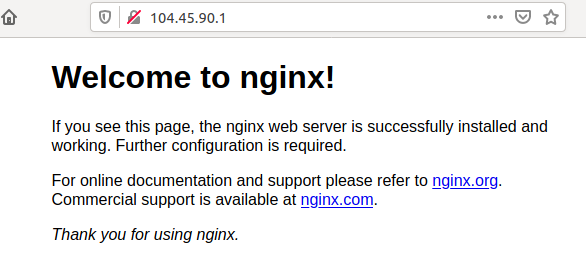

# Creación de una máquina virtual Linux con el CLI de Azure

En esta pequeña guía vamos a ver como instalamos una máquina virtual Ubuntu en Azure. El guón que vamos a seguir es el siguiente:

    1. Crear un grupo de recursos.
    2. Crear una máquina virtual.
    3. Apertura de puertos para el tráfico web.
    4. Instalación de un servidor web para realizar pruebas.
    5. Limpieza de recursos.
    6. Script sencillo.

## 1. Crear un grupo de recursos.

Antes de crear el grupo de recursos, tenemos que decidir en que zona la vamos a crear. Para ver las posibles zonas podemos usar:

```bash
    ## Obtenemos todas las zonas
    vthot4@labcell:~/azure_lab/LABs$ az account list-locations

    ## Sólo necesitamos el name por lo que podemos usar
    vthot4@labcell:~/azure_lab/LABs$ az account list-locations |grep name
        "name": "eastasia",
        "name": "southeastasia",
        "name": "centralus",
        "name": "eastus",
        "name": "eastus2",
        "name": "westus",
        "name": "northcentralus",
        "name": "southcentralus",
        "name": "northeurope",
        "name": "westeurope",
        "name": "japanwest",
        "name": "japaneast",
        "name": "brazilsouth",
        ...........................................
    
    ## En este caso usaremos  
    vthot4@labcell:~/azure_lab/LABs$ az account list-locations |grep name|grep northeur
    "name": "northeurope",
```
Decidida la zona, creamos el grupo de recursos. Un grupo de recursos de Azure es un contenedor lógico en el que se implementan y se administran los recursos de Azure.

```bash
    vthot4@labcell:~/azure_lab/LABs$ az group create --name LAB_vthot4 --location northeurope
    {
    "id": "/subscriptions/345gc74f-9632-1046-abd3-d26eh134b4et/resourceGroups/LAB_vthot4",
    "location": "northeurope",
    "managedBy": null,
    "name": "LAB_vthot4",
    "properties": {
        "provisioningState": "Succeeded"
    },
    "tags": null,
    "type": "Microsoft.Resources/resourceGroups"
    }

```
## 2. Crear máquina virtual

A continuación vamos a crear una máquina virtual y le vamos a agregar una cuenta de usuario. Usaremos el parámetro *--generate-ssh-keys* para generar automáticamente una clave SSH y colocarla en la ubicación de la clave predeterminada ( ~/.ssh). Para poder utilizar un conjunto de claves concreto, utilizaremos la opción --ssh-key-value.

```bash
## Creación de la máquina virtual
vthot4@labcell:~/azure_lab/LABs$ az vm create --resource-group LAB_vthot4 --name UbuntuLAB --image UbuntuLTS --admin-username vteteam
{
  "fqdns": "",
  "id": "/subscriptions/345gc74f-9632-1046-abd3-d26eh134b4et/resourceGroups/LAB_vthot4/providers/Microsoft.Compute/virtualMachines/UbuntuLAB",
  "location": "northeurope",
  "macAddress": "00-0D-3A-B0-2E-A1",
  "powerState": "VM running",
  "privateIpAddress": "10.0.0.4",
  "publicIpAddress": "104.45.90.1",
  "resourceGroup": "LAB_vthot4",
  "zones": ""
}

## Comprobamos que la máquina existe
vthot4@labcell:~/azure_lab/LABs$ az vm list

## Nos conectamos de la siguiente forma
vthot4@labcell:~$ ssh vteteam@104.45.90.1

```

## 3. Apertura de puertos para el tráfico web.

Cuando creamos una máqina virtual sólo se habilita el puerto 22. Para abrir otros puertos podemos usar el comando: *az vm open-port*.

```bash
vthot4@labcell:~/azure_lab/LABs$ az vm open-port --port 80 --resource-group LAB_vthot4 --name UbuntuLAB
....................................
{
      "access": "Allow",
      "description": null,
      "destinationAddressPrefix": "*",
      "destinationAddressPrefixes": [],
      "destinationApplicationSecurityGroups": null,
      "destinationPortRange": "80",
      "destinationPortRanges": [],
      "direction": "Inbound",
      "etag": "W/\"345gc74f-9632-1046-abd3-d26eh134b4et\"",
      "id": "/subscriptions/345gc74f-9632-1046-abd3-d26eh134b4et/resourceGroups/LAB_vthot4/providers/Microsoft.Network/networkSecurityGroups/UbuntuLABNSG/securityRules/open-port-80",
      "name": "open-port-80",
      "priority": 900,
      "protocol": "*",
      "provisioningState": "Succeeded",
      "resourceGroup": "LAB_vthot4",
      "sourceAddressPrefix": "*",
      "sourceAddressPrefixes": [],
      "sourceApplicationSecurityGroups": null,
      "sourcePortRange": "*",
      "sourcePortRanges": [],
      "type": "Microsoft.Network/networkSecurityGroups/securityRules"
    }
....................................
```

## 4. Instalación de un servidor web para realizar pruebas.

Ahora vamos a instalar un servidor nginx para comprobar que todo funciona correctamente.

```bash

    vteteam@UbuntuLAB:~$ sudo apt-get -y update
    vteteam@UbuntuLAB:~$ sudo apt-get -y install nginx

```
Una vez instalado podemos comprobar el resultado de la siguiente forma:

<p align="center">
  
</p>


## 5. Limpieza de recursos.

La limpieza de recursos esrelativamente sencilla, ya que bastará con eliminar el grupo de recursos que creamos al principio.

```bash
vthot4@labcell:~$ az group delete --name LAB_vthot4
Are you sure you want to perform this operation? (y/n): y
```


## 6. Script sencillo.

Con este sencillo script podemos realizar todas las pruebas de forma ágil. 

```bash
#!/bin/bash
################################################
#
#   Script sencillo para crear un VM en azure
#
################################################

##---- Variables ----##

LOCATION=northeurope        # Location where you want to deploy the VM
RESOURCE_NAME=LAB_vthot4    # Name of Resource Group.
VM_NAME=UbuntuLAB           # Name of VM
VM_IMAGE=UbuntuLTS          # Image you want to use for VM.
VM_USER=vteteam             # User to connect to the VM

help(){
    echo "$0 Usage:"
	echo " "
	echo " create       Create a VM "
    echo " connect      Connect to the VM"
    echo " webservice   Install nginx server"
	echo " delete       Delete VM "
	echo " "
}

create_Resource(){
	az group create --name $RESOURCE_NAME --location $LOCATION
	sleep 2
}

get_IP(){
    IP_VM=$(az vm show -d -g $RESOURCE_NAME -n $VM_NAME --query "publicIps" -o tsv)
}

case $1 in 
	create)
		echo " Creating resource ....$RESOURCE_NAME"
		create_Resource

		echo " Creating VM ..... $VM_NAME with image: $VM_IMAGE"
		az vm create --resource-group $RESOURCE_NAME --name $VM_NAME --image $VM_IMAGE --admin-username $VM_USER
		;;
    
    connect)
        echo " Conecting ...."
        ## Get VM's public IP
        get_IP
        echo $IP_VM
        ssh $VM_USER@"$IP_VM"
        ;;
    
    webservice)
        echo " Install nginx service ......"
        get_IP
        ssh $VM_USER@"$IP_VM" sudo apt-get -y update
        ssh $VM_USER@"$IP_VM" sudo apt-get -y install nginx
        
        echo " "
        echo "Abriendo puertos ...."
        az vm open-port --port 80 --resource-group $RESOURCE_NAME --name $VM_NAME
        ;;

    all)
        echo " Creating resource ....$RESOURCE_NAME"
		create_Resource

		echo " Creating VM ..... $VM_NAME with image: $VM_IMAGE"
		az vm create --resource-group $RESOURCE_NAME --name $VM_NAME --image $VM_IMAGE --admin-username $VM_USER
		echo " Install nginx service ......"
        get_IP
        ssh $VM_USER@"$IP_VM" sudo apt-get -y update
        ssh $VM_USER@"$IP_VM" sudo apt-get -y install nginx
        
        echo " "
        echo "Abriendo puertos ...."
        az vm open-port --port 80 --resource-group $RESOURCE_NAME --name $VM_NAME
        echo ""
        echo "http://$IP_VM/"
        ;;

    ip)
        get_IP
        echo "$IP_VM"
        ;;

	delete)
		echo " Deletng AKS cluster ........ "
		az group delete --name $RESOURCE_NAME
		;;

	*)
		help
		;;
esac

```


## Bibliografía
- https://docs.microsoft.com/es-es/azure/virtual-machines/linux/quick-create-cli
